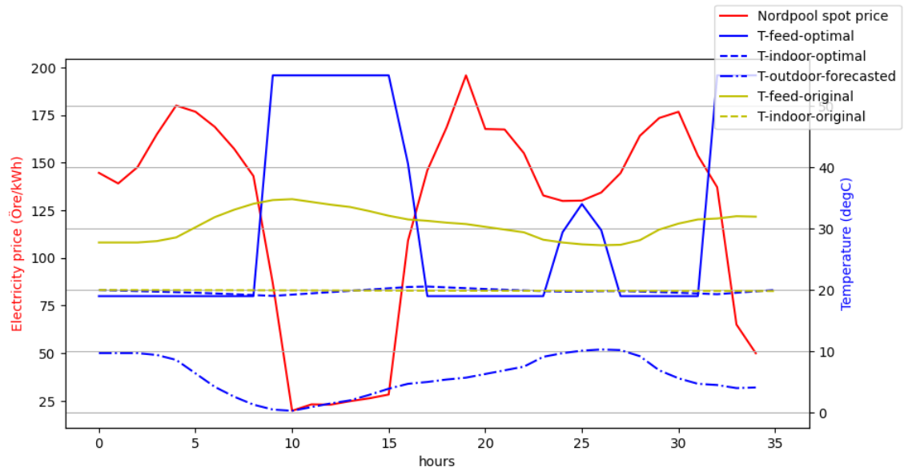

# Esther
Esther is an **E**conomically **S**mart **Ther**mostat which runs continuous, online optimizations using a Model Predictive Control (MPC) scheme to minimize your heating cost. For further reading on Model-Predictive Control in general, see [here](https://en.wikipedia.org/wiki/Model_predictive_control). It does so by continuously finding an optimal control strategy for the heating system over a receeding time horizon, where the control strategy accounts for current and future hourly electricity prices from the Nordpool energy market, forecasted outdoor temperatures, the currently sensed indoor temperature and the thermodynamical properties of the house and heating system.

Esther operates as a standalone microservice with a MQTT api. In essence, Esther requires the following sensoric inputs to be provided (i.e. Esther will need to be configured to subscribe to topic(s) that provide these data continously):

- Outdoor temperature
- Indoor temperature

And calculates and outputs (i.e. publishes continuously) the following:

- Optimal feed temperature

A single optimization (in this particular case over a time horizon of 35 hours) run may result in results looking like this:


Which evaluates to a saving (in comparison with the original heating curve used by the heatpump) of about 18%.

### Limitations

Currently, the following limitations apply:

- Only Swedish locations are supported due to:
    - The Nordpool electricy price api used by Esther only supports Swedish price areas
    - The weather forecast service api used by Esther is limited to Swedish locations

- Only single-source, waterborne heating systems are supported
- The thermodynamical model assumes the house to be a single heated unit, i.e. it does not differentiate between floors and/or rooms.


## How to run it
Packaged as a docker image for easy setup, at: `ghcr.io/freol35241/esther`

The container acts as a command line application and accepts input according to the following:
```
Esther - an economically smart thermostat

positional arguments:
  host                  Hostname of MQTT broker
  port                  Port number of MQTT broker

optional arguments:
  -h, --help            show this help message and exit
  -u USERNAME, --username USERNAME
                        Username to use for accessing the MQTT broker (default: None)
  -p PASSWORD, --password PASSWORD
                        Password to use for accessing the MQTT broker (default: None)
  --T-outdoor-topic T_OUTDOOR_TOPIC
                        Topic on which to listen for outdoor temperature sensor values (default: None)
  --T-outdoor-jsonpointer T_OUTDOOR_JSONPOINTER
                        JsonPointer for resolving the value in the payload on T-outdoor-topic (default: )
  --T-indoor-topic T_INDOOR_TOPIC
                        Topic on which to listen for indoor temperature sensor values (default: None)
  --T-indoor-jsonpointer T_INDOOR_JSONPOINTER
                        JsonPointer for resolving the value in the payload on T-indoor-topic (default: )
  --T-feed-target-topic T_FEED_TARGET_TOPIC
                        Topic on which to publish new optimal target values for the feed temperature (default: None)
  --sensor-timeout SENSOR_TIMEOUT
                        Maximum allowed time (s) between sensor readings (T-indoor and T-outdoor). If exceeded, no new optimal feed temperature will be calculated and outputted until sensor readings are within the given timeout again. (default:     
                        600)
  --T-indoor-requested T_INDOOR_REQUESTED
                        Requested indoor temperature (default: 20.0)
  --T-indoor-bounds T_INDOOR_BOUNDS
                        Allowed bounds of indoor temperature relative to T-indoor-requested. (default: (-2, 2))
  --T-feed-maximum T_FEED_MAXIMUM
                        Maximum allowable feed temperature (default: 60.0)
  --nordpool-price-area NORDPOOL_PRICE_AREA
                        Nordpool price area, eg: SE3 (default: None)
  --longitude LONGITUDE
                        Longitude for SMHI weather forecasts (default: None)
  --latitude LATITUDE   Latitude for SMHI weather forecasts (default: None)
  --heating-curve-slope HEATING_CURVE_SLOPE
                        Heating curve slope value, IVT490-style. (default: None)
  -d, --debug           Print lots of debugging statements (default: 30)
  -v, --verbose         Be verbose (default: None)
  ```


